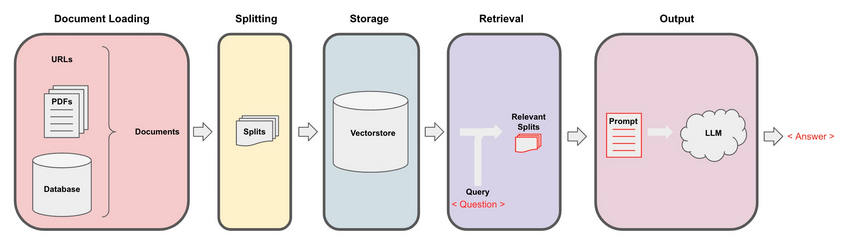

# chatbot-pdf
 A chatbot that enables seamless interaction with your PDFs

## Retrieval-Augmented Generation (RAG)

Retrieval-Augmented Generation (RAG) boosts an LLM’s capabilities by retrieving relevant documents from an external dataset during execution.

This approach is particularly useful for answering questions based on specific documents, such as PDFs, videos, or other structured data sources.

## Overview
This code loads a pdf into text, split the text into chunks, embeds the text using `OllamaEmbeddings`, and saves them in a vectorDatabase. Then the chatbot retrieves the most relevent chunks and answers the user questions.

## Requirements
Ensure you have the following dependencies installed:

+ Python 3.x
+ PyPDFLoader for loading PDFs
+ RecursiveCharacterTextSplitter for splitting text into manageable chunks
+ OllamaEmbeddings for creating embeddings
+ DocArrayInMemorySearch for in-memory vector search
+ ConversationalRetrievalChain from LangChain for conversational querying

##  Installation 
Install the required dependencies using pip:  
`pip install langchain langchain-ollama pypdf docarray`
<<<<<<< HEAD

Install ollama and download llama3.2:1b :  
ollama : [Download Ollama](https://ollama.com/download) 📥  
download llama3.2:1b using this command: `ollama pull llama3.2:1b`
=======
>>>>>>> f2c587cd181b36a24ba2a770028188b98373d41e

## Script Breakdown
+ Loading the PDF: Uses `PyPDFLoader` to extract text.
+ Text Splitting: Splits text into 1000-character chunks with 150-character overlap using `RecursiveCharacterTextSplitter`.
+ Embedding & Vector Search: Uses `OllamaEmbeddings` to generate embeddings and `DocArrayInMemorySearch` for similarity-based retrieval.
+ Conversational Chain: Utilizes `ConversationalRetrievalChain` with an `OllamaLLM` model to generate responses.
+ Chat Interaction: Stores chat history and responds to user queries based on retrieved documents.
